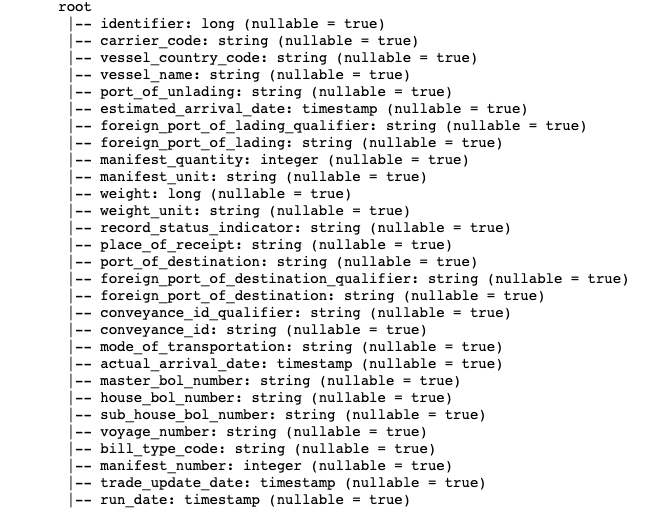
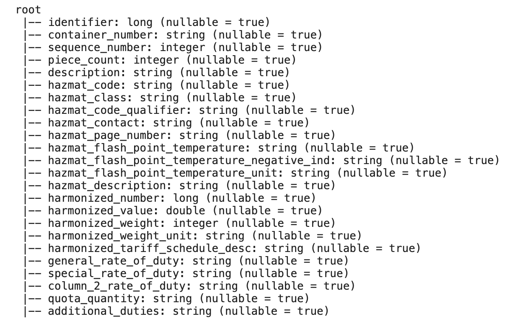
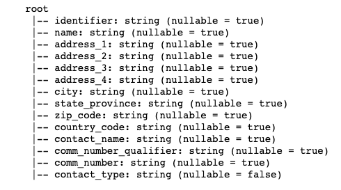
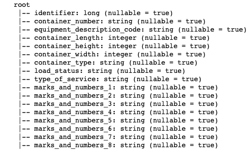
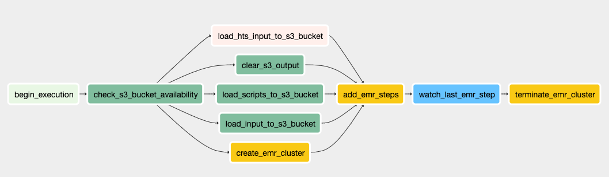

# US import data pipeline

The source is [Amazon Data Exchange](https://aws.amazon.com/marketplace/pp/US-Imports-Automated-Manifest-System-AMS-Shipments/prodview-stk4wn3mbhx24). It contains data for US imports from 2018 to 2020. I assume it will also contain 2021 data when it becomes available. 

## Input data

Each year's data contains 11 datasets for header, bill, cargo description, hazmat, hazmat class, tariff, cosignee, notified party, shipper, container, and mark number.

For information on these datasets and their columns, refer to this [notebook](https://github.com/jackyho112/us-import-data-pipelines/blob/main/notebooks/exploration.ipynb). You can also refer to the Amazon Data Exchange [overview page](https://aws.amazon.com/marketplace/pp/US-Imports-Automated-Manifest-System-AMS-Shipments/prodview-stk4wn3mbhx24#offers).

## Output data

This data pipeline outputs four datasets in CSV files aggregating each year of import data. Here are the table schemas (from Spark) and how they are assembled.

# Fact:

**Header table -**

From joining the header and bill dataset



Refer to the [notebook](https://github.com/jackyho112/us-import-data-pipelines/blob/main/notebooks/bill_spark_op.ipynb) and [script](https://github.com/jackyho112/us-import-data-pipelines/blob/main/airflow/plugins/scripts/assemble_header.py) for more details

# Dimension:

**Cargo table -** 

From joining the cargo description, hazmat, and hazmat class datasets. Each row in each dataset describes a cargo in a shipment.



Refer to the [notebook](https://github.com/jackyho112/us-import-data-pipelines/blob/main/notebooks/cargo_spark_op.ipynb) and [script](https://github.com/jackyho112/us-import-data-pipelines/blob/main/airflow/plugins/scripts/assemble_cargo.py) for more details

**Contact table -** 

From joining the cosignee, notified party, and shipper datasets which are all contact parties for a shipment



Refer to the [notebook](https://github.com/jackyho112/us-import-data-pipelines/blob/main/notebooks/contact_spark_op.ipynb) and [script](https://github.com/jackyho112/us-import-data-pipelines/blob/main/airflow/plugins/scripts/assemble_contact.py) for more details

**Container table -** 

From joining the container and mark datasets.



Refer to the [notebook](https://github.com/jackyho112/us-import-data-pipelines/blob/main/notebooks/container_spark_op.ipynb) and [script](https://github.com/jackyho112/us-import-data-pipelines/blob/main/airflow/plugins/scripts/assemble_container.py) for more details

## Pipeline: 

# US import ETL



Summary:

1. Check that the specified buckets (one for data storage, and one for logs) are available
2. Load data and scripts to the bucket
3. Create an [EMR](https://aws.amazon.com/emr/) cluster and load necessary jobs to the cluster
4. Termiante the cluster when everything is done

Details at the [dag file](https://github.com/jackyho112/us-import-data-pipelines/blob/main/airflow/dags/us_import_dag.py)

## Running Airflow

In the Airflow folder,

to start the scheduler:
```bash
airflow scheduler
```

to start the web sever:
```bash
airflow webserver -p 8080
```

For more information on Airflow, go to its [site](http://airflow.apache.org/docs/stable/)
